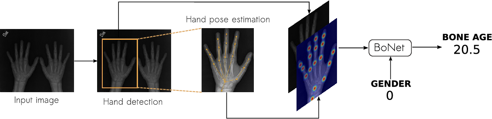

# **BoNet**

This repository provides a PyTorch implementation of BoNet, presented in the paper [Hand Pose Estimation for Pediatric Bone Age Assessment](https://doi.org/10.1007/978-3-030-32226-7_60). Oral presentation at [MICCAI,2019](https://www.miccai2019.org/). BoNet leverages local information and significantly outperforms state-of-the-art methods in Bone Age Assessment (BAA). We propose a new experimental framework with hand detection and hand pose estimation as new tasks to extract local information for BAA methods. We also introduce the Radiological Hand Pose Estimation (RHPE) dataset. Thanks to its fine-grained and precisely localized annotations, our dataset will allow to exploit local information to push forward automated BAA algorithms. To ensure reproducibility of our results and to promote further research on
BAA we created the [Bone Age Assessment Resources (BAAR)](http://malik.uniandes.edu.co/baar). 
<br/>

## Bone Age Assessment Resources
We created the [Bone Age Assessment Resources (BAAR)](http://malik.uniandes.edu.co/BAAR) as a platform for promoting the development of BAA algorithms. In the BAAR you can download the RSNA and RHPE [datasets](http://malik.uniandes.edu.co/baar/dataset) with keypoints, bounding box and boneage annotations for the training and validation sets. Additionally, you can explore an overview of the methods BCV has developed for this task. Finally, the BAAR include an [evaluation server](http://malik.uniandes.edu.co/baar/evaluation) for the test set of RHPE and RSNA
## Paper
[Hand Pose Estimation for Pediatric Bone Age Assessment](https://link.springer.com/chapter/10.1007%2F978-3-030-32226-7_59) <br/>
[María Escobar](https://mc-escobar11.github.io/)<sup> 1* </sup>, [Cristina González](https://cigonzalez.github.io/)<sup> 1* </sup>, [Felipe Torres](https://ftorres11.github.io/) <sup>1</sup>,[Laura Daza](https://sites.google.com/view/ldaza/en)<sup>1</sup>, [Gustavo Triana](http://radiologiafsfb.org/site/index.php?option=com_content&view=category&id=176&Itemid=332)<sup>2</sup>, [Pablo Arbeláez](https://scholar.google.com.co/citations?user=k0nZO90AAAAJ&hl=en)<sup>1</sup> <br/>
<sup>*</sup>Equal contribution.<br/>
<sup>1 </sup>Biomedical Computer Vision ([BCV](https://biomedicalcomputervision.uniandes.edu.co/)) Lab, Universidad de Los Andes. <br/>
<sup>2 </sup>Radiology department, Fundación Santa Fe de Bogotá. <br/>
<br/>

<p align="center"></p>

## Citation
```
@inproceedings{escobar2019hand,
  title={Hand Pose Estimation for Pediatric Bone Age Assessment},
  author={Escobar, Mar{\'\i}a and Gonz{\'a}lez, Cristina and Torres, Felipe and Daza, Laura and Triana, Gustavo and Arbel{\'a}ez, Pablo},
  booktitle={International Conference on Medical Image Computing and Computer-Assisted Intervention},
  pages={531--539},
  year={2019},
  organization={Springer}
}

```
<br/>
The source code for BoNet and pretrained models will be available soon.
<br/>

